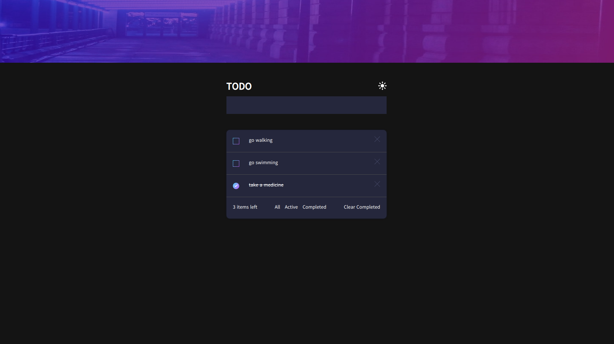

# React My-Todo



This app is mainly developed by reactjs library.
In this project you can manage your todos and you can also toggle the theme.

## Features

- **Reactjs**
- **ContextApi**
- **Styled Components**
- **Theme switching**

## Installing Application

You can installed app by either downloading the repository or cloning the repository.
After cloning/downloading process is completed, run the below commands by step by step

### Installing Dependencies

```
npm i or yarn
```

### Running Application

```
npm start or yarn start
```
